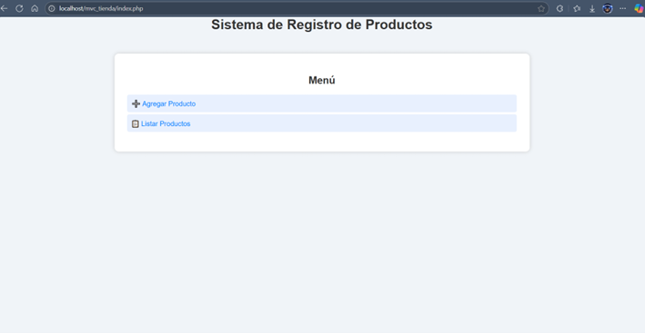
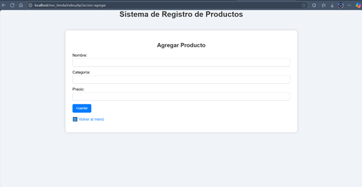
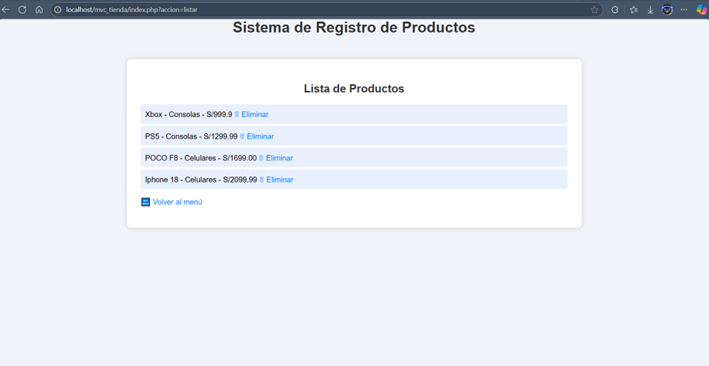

# 🛍️ Sistema MVC - Registro de Productos (PHP)

Este proyecto implementa la arquitectura **MVC** usando PHP sin frameworks. Permite registrar, listar y eliminar productos en una tienda.

## 📁 Estructura del proyecto
```
└── 📁mvc_tienda
    └── 📁capturas
        ├── formulario.png
        ├── listado.png
        ├── menu.png
    └── 📁controlador
        ├── controlador.php
    └── 📁css
        ├── estilos.css
    └── 📁datos
        ├── productos.txt
    └── 📁modelo
        ├── modelo.php
    └── 📁vista
        ├── agregar.php
        ├── listar.php
        ├── menu.php
        ├── plantilla.php
    ├── index.php
    └── README.md
```
## 📸 Capturas de pantalla

### 🧭 Menú principal


### 📝 Formulario de producto


### 📋 Listado de productos

## 🚀 Funcionalidades

- Agregar productos (nombre, categoría, precio)
- Listar productos registrados
- Eliminar productos
- Interfaz básica con CSS

## 💻 Requisitos

- PHP (XAMPP)
- Navegador web
- Visual Studio Code

## 📦 Ejecución

1. Coloca la carpeta en `htdocs` de XAMPP
2. Inicia Apache
3. Accede desde el navegador: `http://localhost/mvc_tienda`

## © 2025 Alvaro — [Alvav2](https://github.com/Alvav2)


